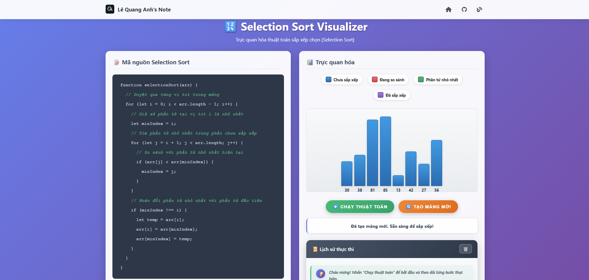

# Selection Sort Visualization

This is a simple web project that demonstrates how the **Selection Sort** algorithm works.  
The site is built using only **HTML, CSS, and JavaScript**, and deployed on GitHub Pages with a custom domain.  

👉 Live demo: [selection-sort.lequanganh.id.vn](https://selection-sort.lequanganh.id.vn)

---

## 📸 Demo Preview

---

## 🔍 About the Project
- Pure **front-end** project (no frameworks, no backend).
- Interactive **visualization** of the Selection Sort algorithm.
- Clean and minimal UI so that anyone can easily understand how the algorithm works step by step.

---

## 🚀 How It Works
1. The array is generated with random numbers.
2. The algorithm iterates through the array to find the minimum element.
3. It swaps the minimum with the first unsorted element.
4. Steps are repeated until the array is sorted.
5. All operations are visualized in real time.

---

## 🛠️ Tech Stack
- **HTML5**
- **CSS3**
- **JavaScript (Vanilla)**

---

## 🌐 Deployment
This project is hosted on **GitHub Pages** and linked to a **custom subdomain**:
- Domain: `selection-sort.lequanganh.id.vn`
- Managed via GitHub Pages + DNS CNAME record

---

## 📚 Learning Goals
- Understand Selection Sort visually.
- Practice working with DOM manipulation in JavaScript.
- Deploy a static website using GitHub Pages.
- Configure a custom subdomain for GitHub Pages.

---

## 👤 Author
- **Name:** Lê Quang Anh  
- **GitHub:** [lequanganh](https://github.com/lequanganh)  
- **Website:** [lequanganh.id.vn](https://lequanganh.id.vn)
